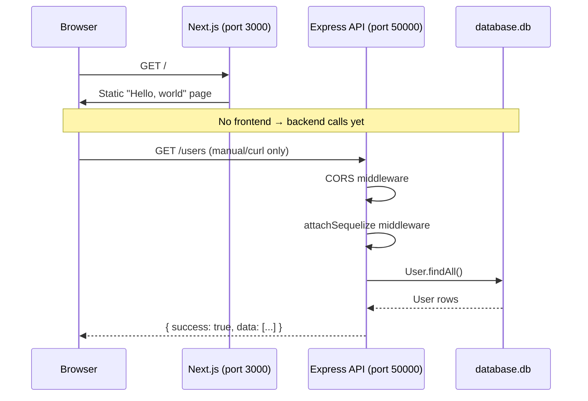
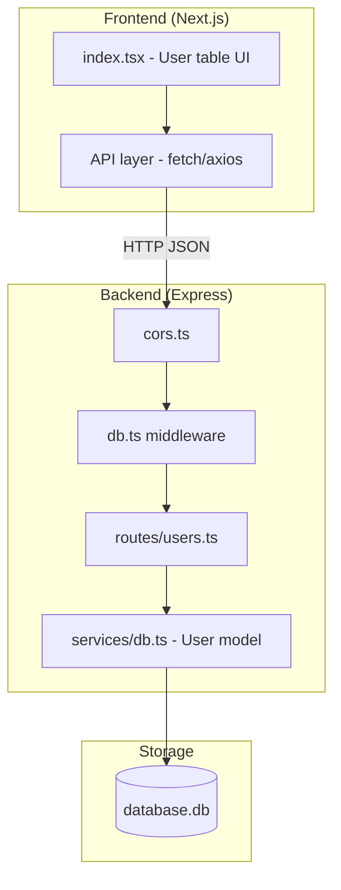

# Frontend to backend overview
_Exported on 05/08/2026 at 17:00:59 GMT-7 from Cursor (3.8.11)_

---

**User**

In the given project - I want to understand the significance of all folders/files within: 1. Backend, 2. Frontend
I want to understand the data flow from Frontend to backend and every single important file involved in it. This is needed since it will help me understand how to plan out my backend for a given set of requirements.

---

**Cursor**

I'll map the Backend and Frontend layout first, then trace how requests move from the UI through to the server.


This is an **Atllas takehome** monorepo: a Next.js frontend and an Express + Sequelize backend, started together with `npm run start`. The scaffold is intentionally minimal — the backend exposes one read endpoint, and the frontend does not call it yet. Understanding that baseline is the key to planning your work.

---

## Monorepo layout (context)

```
AtllasX/
├── package.json          # Root scripts: start, seed, bundle
├── scripts/
│   ├── run.mjs           # Starts frontend + backend concurrently
│   └── seed.ts           # Populates SQLite with fake users
└── packages/
    ├── back-end/         # Express API (port 50000)
    └── front-end/        # Next.js app (port 3000)
```

| Root file | Role |
|-----------|------|
| `package.json` | npm workspaces linking both packages; `npm run start` runs both |
| `scripts/run.mjs` | Uses `concurrently` to run `back-end` and `front-end` dev servers |
| `scripts/seed.ts` | Creates/resets DB and inserts 1,000 (or 5,000 with `--full`) users |
| `database.db` | SQLite file at repo root (created after seeding) |

---

## 1. Backend (`packages/back-end/`)

### Folder structure

```
packages/back-end/
├── package.json
├── tsconfig.json
└── src/
    ├── app.ts                 # Express entry point
    ├── routes/
    │   └── users.ts           # /users API (only route today)
    ├── middleware/
    │   ├── cors.ts            # CORS for browser requests
    │   └── db.ts              # Attaches Sequelize to each request
    ├── services/
    │   └── db.ts              # DB connection + User model (schema)
    └── types/
        ├── IRoute.ts          # Route module contract
        └── express/index.d.ts # TypeScript augmentation for req.services
```

### File-by-file significance

#### `src/app.ts` — server bootstrap

This is the Express entry point. It:

1. Creates the Express app
2. Applies global middleware (CORS, DB)
3. **Auto-discovers routes** from `src/routes/` — any file exporting a default `IRoute` is mounted automatically
4. Listens on `http://127.0.0.1:50000` (configurable via `EXPRESS_PORT` / `EXPRESS_HOST`)

```15:40:packages/back-end/src/app.ts
// Attach any middleware
app.use(Cors);
app.use(attachSequelize);

// Read all entries from the "routes" directory. Filter out any entry that is not a file.
const _ROUTES_ROOT = resolve(join(__dirname, './routes/'));
const queue = readdirSync(_ROUTES_ROOT)
  .map(entry => join(_ROUTES_ROOT, entry))
  .filter(isFile);

// For each item in the queue, inject it as an API route.
queue.forEach(entry => {
  try {
    const required = require(entry);
    if (required?.default) {
      const { route, router }: IRoute = required.default;
      app.use(route, router());
```

**Planning note:** Add new API areas by adding files under `routes/` (e.g. `users.ts` already exists). No changes to `app.ts` are required.

#### `src/services/db.ts` — database schema (fixed)

This defines the **User model** you must use (per README). Fields:

| Field | Type | Notes |
|-------|------|-------|
| `id` | INTEGER | PK, auto-increment |
| `registered` | DATE | Registration date |
| `firstName`, `lastName` | STRING | Required |
| `middleName` | STRING | Optional |
| `email` | STRING | Required, unique |
| `phoneNumber`, `address` | STRING | Optional |
| `adminNotes` | STRING | Required, default `''` |

SQLite path: `database.db` at repo root (or `EXPRESS_SQLZ_DB` env var).

#### `src/middleware/db.ts` — DB readiness

Before any route handler runs, this middleware:

1. Calls `sequelize.authenticate()` once
2. Attaches `req.services.sequelize` for handlers that need it

Route handlers can also import `User` directly from `services/db.ts` (as `users.ts` does).

#### `src/middleware/cors.ts` — cross-origin access

Sets `Access-Control-Allow-Origin: *` so the Next.js app on port 3000 can call the API on port 50000.

#### `src/routes/users.ts` — current API (read-only)

Only endpoint implemented today:

- **`GET /users`** → returns all users as JSON

```10:29:packages/back-end/src/routes/users.ts
    router.route('/')
      // Fetch all users
      .get(async (req, res) => {
        // pro tip: if you're not seeing any users, make sure you seeded the database.
        //          make sure you read the readme! :)

        return User.findAll()
          .then(users => {
            return res.json({
              success: true,
              data: users,
            });
          })
```

**Not yet implemented (your work):** POST, PUT/PATCH, DELETE, search, sort, pagination for infinite scroll.

#### `src/types/IRoute.ts` — route module contract

Every route file must export:

```typescript
{
  route: '/users',   // mount path
  router(): Router  // Express router factory
}
```

#### `src/types/express/index.d.ts` — TypeScript types

Extends Express `Request` with `req.services.sequelize` for type safety.

---

## 2. Frontend (`packages/front-end/`)

### Folder structure

```
packages/front-end/
├── package.json
├── tsconfig.json
├── next.config.js
├── tailwind.config.js
├── postcss.config.js
├── public/                    # Static assets (favicon, SVGs)
└── src/
    ├── pages/
    │   ├── _app.tsx           # App wrapper (loads global CSS)
    │   ├── _document.tsx      # HTML shell
    │   └── index.tsx          # Home page (stub UI)
    └── styles/
        └── globals.css        # Tailwind imports
```

### File-by-file significance

#### `src/pages/index.tsx` — main page (stub)

Currently a placeholder: title “User Management” and “Hello, world.” **No API calls, no table, no CRUD UI yet.**

This is where you will build the user table, forms, search, sort, and infinite scroll.

#### `src/pages/_app.tsx` — global app wrapper

Wraps every page and imports `globals.css`. Add global providers here (React Query, theme, etc.) if needed.

#### `src/pages/_document.tsx` — HTML document

Standard Next.js document shell (`<Html>`, `<Head>`, `<body>`).

#### Config files

| File | Role |
|------|------|
| `next.config.js` | Next.js config (`reactStrictMode: true`) |
| `tailwind.config.js` | Tailwind CSS setup |
| `postcss.config.js` | PostCSS for Tailwind |
| `tsconfig.json` | TypeScript for Next.js (JSX, DOM types) |

#### `public/`

Static files served at `/` (favicon, logos). Not part of data flow.

---

## 3. Data flow: Frontend → Backend (current vs. target)

### Current state (scaffold only)



There is **no `fetch`, axios, or API client** in the frontend today. The backend works if you hit it directly:

```bash
curl http://127.0.0.1:50000/users
```

(after `npm run seed`).

### Target flow (what you will build)



### Request path (when wired)

1. **User action** (load page, search, scroll, add/edit/delete) in `index.tsx` (or components you add)
2. **HTTP call** from browser to `http://127.0.0.1:50000/users...`
3. **CORS** (`cors.ts`) allows the cross-origin request
4. **DB middleware** (`db.ts`) ensures Sequelize is connected
5. **Route handler** (`routes/users.ts`) runs business logic
6. **Sequelize** (`User` model) reads/writes SQLite
7. **JSON response** `{ success: true, data: ... }` back to the frontend
8. **UI update** from the response

---

## 4. Backend planning for the requirements

From the README, you need:

| Requirement | Backend responsibility | Suggested API shape |
|-------------|------------------------|---------------------|
| List users | Already started | `GET /users` |
| Infinite scroll | Pagination | `GET /users?offset=0&limit=50` or cursor-based |
| Search by name/email | Query filters | `GET /users?search=john` or `?q=...` |
| Sort by column | ORDER BY | `GET /users?sort=email&order=asc` |
| Add user | Create | `POST /users` + body |
| Update user | Update | `PUT /users/:id` or `PATCH /users/:id` |
| Delete user | Delete | `DELETE /users/:id` |

All of this belongs in **`packages/back-end/src/routes/users.ts`** (or split into handlers/services if it grows). The `User` schema in `services/db.ts` should stay as-is.

Example Sequelize patterns:

```typescript
// Pagination + search + sort
User.findAll({
  where: {
    [Op.or]: [
      { firstName: { [Op.like]: `%${search}%` } },
      { email: { [Op.like]: `%${search}%` } },
    ],
  },
  order: [[sortField, order]],
  limit,
  offset,
});

// Create
User.create(req.body);

// Update
User.update(fields, { where: { id } });

// Delete
User.destroy({ where: { id } });
```

---

## 5. Frontend planning for the requirements

You will likely add:

| Area | Purpose |
|------|---------|
| `src/pages/index.tsx` | Main user management UI |
| `src/components/` (new) | Table, forms, modals |
| `src/lib/api.ts` or `src/services/users.ts` (new) | Centralized API calls to `http://127.0.0.1:50000` |
| `src/types/user.ts` (new) | Shared User type matching backend |

Example API client:

```typescript
const API_BASE = 'http://127.0.0.1:50000';

export async function getUsers(params?: { offset?: number; limit?: number; search?: string; sort?: string; order?: string }) {
  const qs = new URLSearchParams(params as Record<string, string>);
  const res = await fetch(`${API_BASE}/users?${qs}`);
  return res.json();
}
```

For infinite scroll, use `offset`/`limit` (or cursor) and append results in React state as the user scrolls.

---

## 6. Dev workflow cheat sheet

```bash
npm i                    # Install dependencies
npm run seed             # Create DB + 1,000 users
npm run start            # Frontend :3000 + Backend :50000
curl http://127.0.0.1:50000/users   # Test API directly
```

---

## Summary

| Layer | Status | Key files |
|-------|--------|-----------|
| **Backend entry** | Ready | `app.ts` auto-loads routes |
| **DB schema** | Fixed | `services/db.ts` |
| **API** | Partial | `routes/users.ts` — only `GET /users` |
| **Frontend UI** | Stub | `pages/index.tsx` — no backend integration |
| **Data flow** | Not connected | You wire fetch → Express → Sequelize → SQLite |

The architecture is set up for extension: add route handlers in `routes/`, call them from the frontend via fetch, and keep the provided `User` model. If you want, I can next sketch a concrete API contract (endpoints + request/response shapes) or a folder layout for components and the API client on the frontend.

---

**User**

As a user, I want to be able to search the table by name and email.
Does this mean -> a. Search params at the top of the table to search for user by their name and email? OR b. Search/Filter option on the table for column name and email

---

**Cursor**

The requirement is much closer to **(a)** than **(b)**.

## What the story is asking for

> "Search the table **by name and email**"

That wording means: the user can find rows using **name** and **email** as searchable fields — not that each column gets its own filter control.

In practice, that usually looks like:

- **One search input above the table** that matches against name (first/middle/last) and email, or  
- **Two inputs at the top** — e.g. "Name" and "Email" — if you want separate criteria

Both are still **(a)**: search controls **above** the table, not in column headers.

## Why not (b)?

**(b)** — per-column filter icons/inputs in the Name and Email headers — is a different pattern. Product specs usually say things like:

- "filter by column"
- "column filters"
- "filter each column independently"

This README already separates concerns:

| Story | Typical UI |
|-------|------------|
| Sort by column | Click column headers (↑↓) |
| Search by name and email | Search bar(s) that query those fields |

So search and sort are meant to be different interactions.

## Recommended interpretation (for this takehome)

**Best fit:** a search area at the top of the table.

```
┌─────────────────────────────────────────┐
│  Search: [ name or email...          ]  │  ← single field is fine
└─────────────────────────────────────────┘
│ Name          │ Email           │ ...   │
│ John Smith    │ john@...        │       │
```

Backend example:

```
GET /users?search=john
```

The server searches `firstName`, `middleName`, `lastName`, and `email`.

A **separate name + email** pair at the top is also valid if you want clearer UX:

```
GET /users?name=john&email=gmail
```

## When (b) would be acceptable

Per-column filters on Name and Email can work, but they’re **more than the story asks for** and can feel heavy on mobile. If you go that route, treat it as an extra — not the minimum.

---

**Bottom line:** Implement **(a)** — search control(s) above the table that filter rows by name and/or email. Column-header filters are optional polish, not the core requirement.

